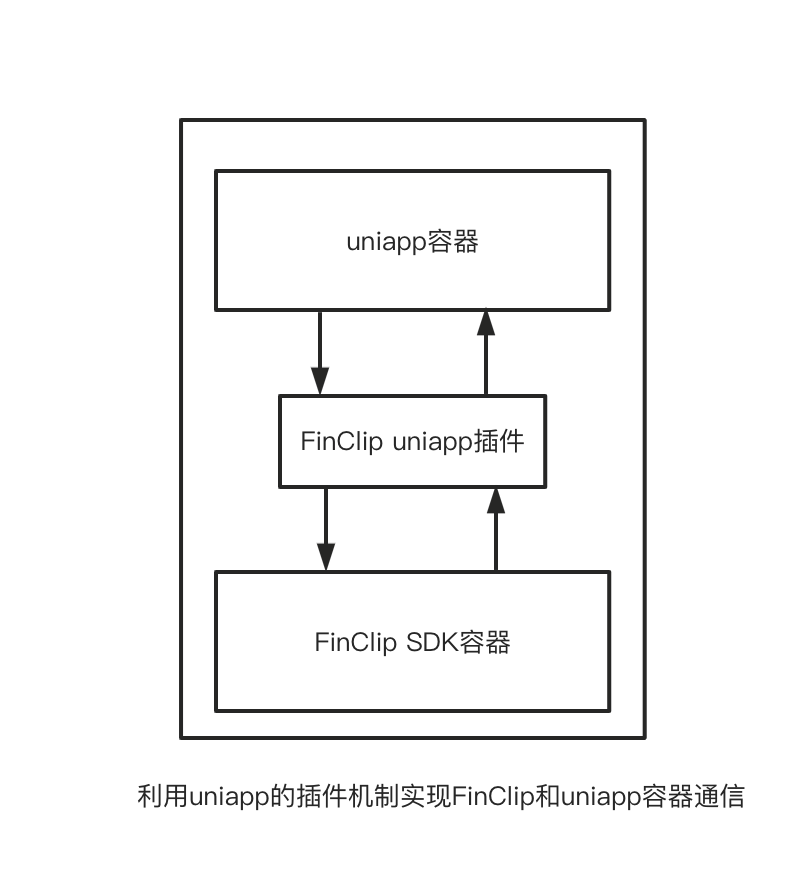

<!--
 * @Descrição: 
 * @versão: 
 * @Autor: sueRimn
 * @Data: 2022-10-19 12:17:40
-->

    

 
    <strong>FinClip Uniapp DEMO</strong> 

 
        Este projeto fornece um exemplo DEMO para rodar pequenos aplicativos no ambiente Uniapp.

 
    👉 <a href="https://www.finclip.com?from=github">https://www.finclip.com/</a> 👈

[Site oficial](https://www.finclip.com/) | [Exemplo de pequeno aplicativo](https://www.finclip.com/#/market) | [Documentação de desenvolvimento](https://www.finclip.com/mop/document/) | [Guia de implantação](https://www.finclip.com/mop/document/introduce/quickStart/cloud-server-deployment-guide.html) | [Guia de integração do SDK](https://www.finclip.com/mop/document/introduce/quickStart/intergration-guide.html) | [Lista de APIs](https://www.finclip.com/mop/document/develop/api/overview.html) | [Lista de componentes](https://www.finclip.com/mop/document/develop/component/overview.html) | [Compromisso de privacidade](https://www.finclip.com/mop/document/operate/safety.html)

-----
## 🤔 O que é o FinClip?

Já **pensou** em como um pequeno aplicativo desenvolvido para WeChat pode ser executado diretamente em seu próprio APP, apenas desenvolvendo uma vez e podendo ser aberto em diferentes aplicativos? Isso não é incrível?

Já **tentou** incorporar um SDK em seu próprio APP, permitindo não só abrir pequenos aplicativos, mas também personalizar interfaces e estilos? Isso parece ainda mais incrível?

Isso é o FinClip, oferecendo tudo isso e muito mais!

## ⚙️ Como funciona
### 1. Método de implementação
Este DEMO usa a [função de plugin](https://nativesupport.dcloud.net.cn/NativePlugin/course/android?id=%e6%8f%92%e4%bb%b6%e5%bc%80%e5%8f%91) do Uniapp para integrar o SDK do FinClip, permitindo a execução de pequenos aplicativos FinClip em aplicativos exportados do Uniapp.

### 2. Princípio de funcionamento
Este projeto foi desenvolvido com `HBuilderX 3.96` e apenas integrou o `FinClip Core SDK (2.42.5)`. Para mais funcionalidades, você pode gerar plugins novamente usando os projetos nativos para iOS/Android.

    

## 📋 Documentação de Integração
[Click aqui](./doc/index.md) para ver a documentação de integração rápida

## 🔗 Links Úteis
Aqui estão alguns links úteis para o desenvolvimento e experiência com o FinClip:

- [Site oficial do FinClip](https://www.finclip.com/#/home)
- [Exemplo de pequeno aplicativo](https://www.finclip.com/#/market)
- [Centro de documentação](https://www.finclip.com/mop/document/)
- [Guia de implantação do SDK](https://www.finclip.com/mop/document/introduce/quickStart/intergration-guide.html)
- [Estrutura do código do pequeno aplicativo](https://www.finclip.com/mop/document/develop/guide/structure.html)
- [Guia de integração para iOS](https://www.finclip.com/mop/document/runtime-sdk/ios/ios-integrate.html)
- [Guia de integração para Android](https://www.finclip.com/mop/document/runtime-sdk/android/android-integrate.html)
- [Guia de integração para Flutter](https://www.finclip.com/mop/document/runtime-sdk/flutter/flutter-integrate.html)

## ☎️ Contate-nos
Escaneie o código QR abaixo no WeChat para seguir o oficial **「凡泰极客」** e obter mais conteúdos interessantes.  

Escaneie o código QR abaixo no WeChat para entrar no grupo oficial e obter mais conteúdos interessantes.  

## Stargazers

## Forkers

