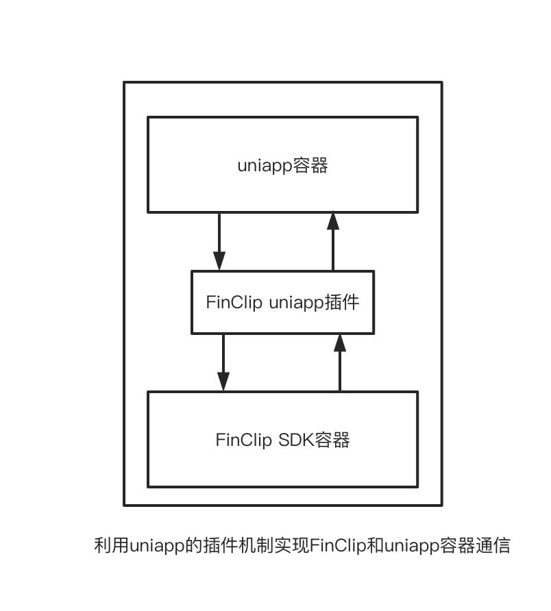
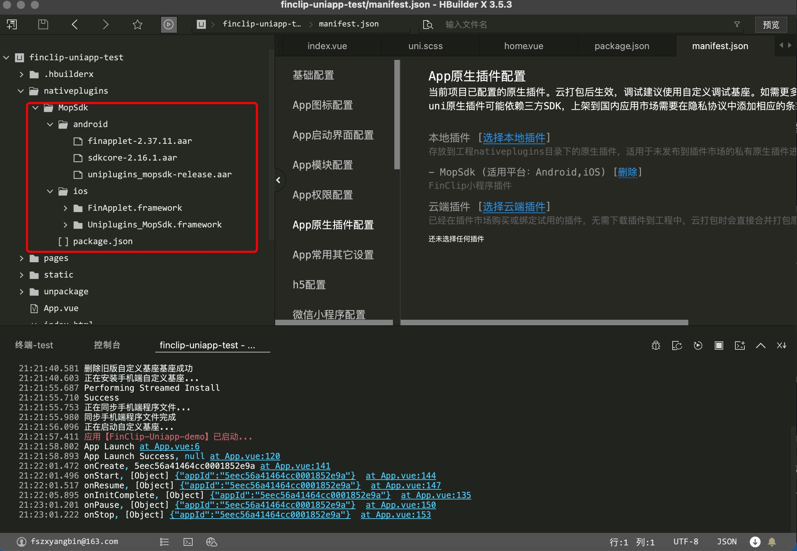
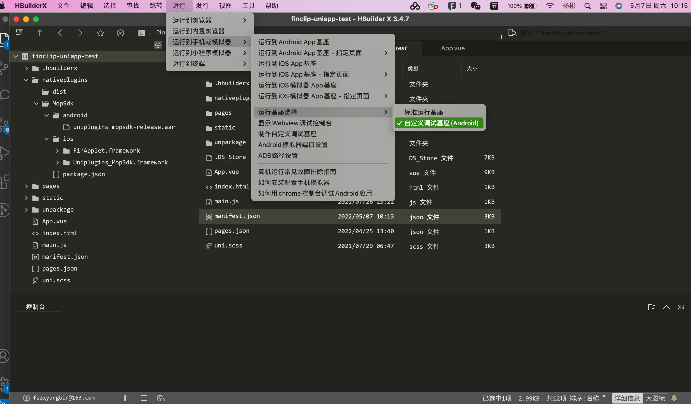
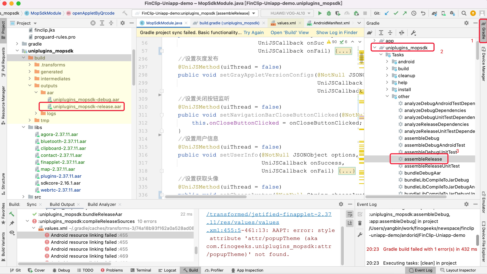
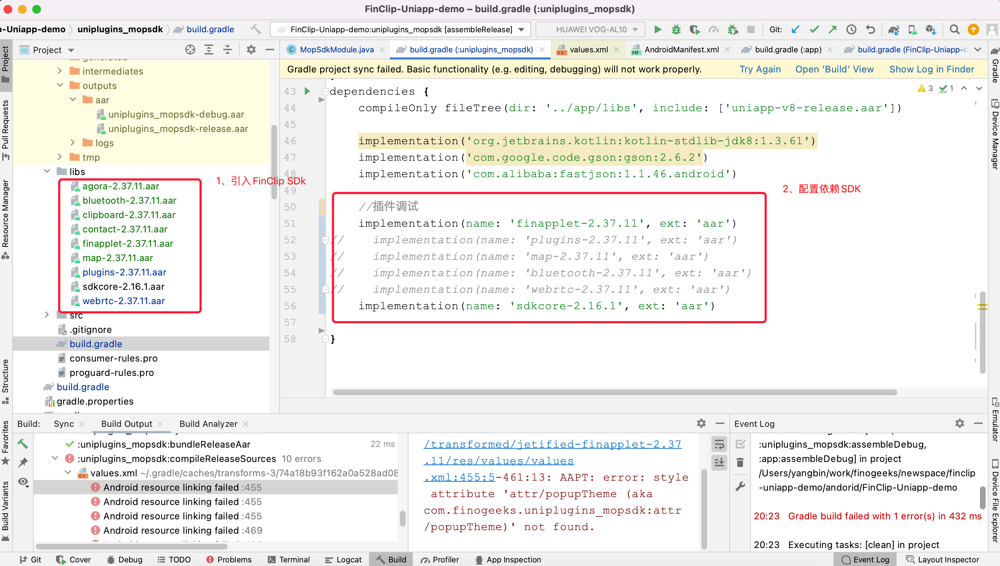
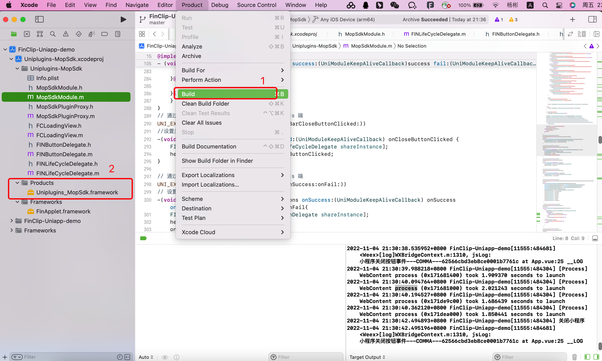

# FinClip-Uniapp-demo

#### 介绍
FinClip SDK 凡泰Uniapp插件，利用Uniapp[插件功能](https://nativesupport.dcloud.net.cn/NativePlugin/course/android),集成FinClip SDK，实现打开小程序。

<figure class="half">
    
    
</figure >

#### 软件架构


#### 使用说明
（注本项目资源使用HBuilderX 3.6.4开发，只集成了FinClip 核心SDK （2.38.3）,如需要更多功能，可使用安卓/IOS原工程重新生成插件）

##### 1.  引入已经生成好的插件

##### 2.  选择插件


 ##### 3.  生成自定度基座方便项目调试 （以安卓为例，注意包名需要和获取 生成[SDK KEY 及 SDK SECRET](https://www.finclip.com/mop/document/introduce/accessGuide/enterprise-guidelines.html#_6-%E5%85%B3%E8%81%94%E7%A7%BB%E5%8A%A8%E5%BA%94%E7%94%A8)的包名一致）




##### 4. 在Uniapp项目中初始FinClip SDK

   获取 [SDK KEY 及 SDK SECRET](https://www.finclip.com/mop/document/introduce/accessGuide/enterprise-guidelines.html#_6-%E5%85%B3%E8%81%94%E7%A7%BB%E5%8A%A8%E5%BA%94%E7%94%A8)

```JavaScript

    const MopSdk = uni.requireNativePlugin('MopSdk');

	export default {
		onLaunch: function() {
            MopSdk.initialize({
                                'sdkKey': '22LyZEib0gLTQdU3MUauAa2CctUv+NxTLFWyPxC28y2gA4x+JWh7hhNS5aO52BFs',
                                'sdkSecret': '65146ffa924ecfdc',
                                'apmServer': 'https://api.finclip.com'
                             },
                             (ret) => {
                                 console.log('App Launch Success', ret)
                             },
                             (ret) =>{
                                 console.log('App Launch Fail', ret)
                             });
        }
    }
    
```

##### 5. 在Uniapp项目中打开小程序

```JavaScript

<template>
	<view class="content">
		<image class="logo" src="/static/logo.png"></image>
		<button type="primary" v-on:click="handleOpenMiniProgram">打开小程序</button>
		<view class="padding-gap"></view>
		<button type="primary" v-on:click="handleOpenMiniProgramByQrcode">二维码打开小程序</button>
	</view>
</template>

<script>
	const MopSdk = uni.requireNativePlugin('MopSdk');
	export default {
		data() {
			return {
				title: 'Hello'
			}
		},
		onLoad() {

		},
		methods: {
			handleOpenMiniProgram() {
				const apiServer = 'https://api.finclip.com'
				const appId = '5eec56a41464cc0001852e9a'
				const startParams = null
				// const startParams = {
				// 	path: '/pages/index/index',
				// 	query: 'a=1&b=2'
				// }
				const sequence = null // 小程序的上架序列号
				const isSingleton = false //安卓启动单任栈
				MopSdk.openApplet({apiServer,
				                  appId,
								  startParams,
								  sequence,
								  isSingleton})
			},
			handleOpenMiniProgramByQrcode() {
				uni.scanCode({
					success: (result) => {
						console.log(result)
						const qrCode = result.result //二维码信息
						const isSingleton = false //安卓启动单任栈
						MopSdk.openAppletByQrcode({qrCode,isSingleton},
						                  (ret) => {
											  console.log('onSuccess',ret)	
										  },
										  (ret) => {
											  console.log('onFail',ret)	
										  },
										  (ret) => {
										  	console.log('onProcess',ret)								  
										  })
					}
				})
				
			}
		}
	}
</script>

```
#### 插件API
##### 1、初始化API
```JavaScript
MopSdk.initialize({
						'sdkKey': '22LyZEib0gLTQdU3MUauAa2CctUv+NxTLFWyPxC28y2gA4x+JWh7hhNS5aO52BFs',
						'sdkSecret': '65146ffa924ecfdc',
						'apmServer': 'https://api.finclip.com',
						//'apiServer': 'https://api.finclip.com',
						// 'apiPrefix': '/api/v1/mop/',
						// 'cryptType': 'MD5',
						// 'sdkFingerprint': '',
						// 'encryptServerData': false,
						// 'userId': '',
						// 'customWebViewUserAgent': '',
						// 'bindAppletWithMainProcess': false,
						// 'maxRunningApplet': 5,
						// 'apmExtension'
						// 'enableAppletDebug'
						// 'disablePermission': false,
						// 'disableGetSuperviseInfo'
						// 'disableRequestPermissions'
						// 小程序界面UI
						uiConfig: {
							//是否隐藏小程序加载界面的关闭按钮
							hideTransitionCloseButton: true,
							//屏蔽更多菜单中的“转发”按钮
							hideForwardMenu: false,
							//屏蔽更多菜单中的“设置”按钮
							hideSettingMenu: false,
							//屏蔽更多菜单中的“返回首页”按钮
							hideBackToHome: false,
							//屏蔽更多菜单中的“反馈与投诉”按钮
							hideFeedbackMenu: false,
							//SDK中“小程序”文案替换为任意其它名称
							//appletText: '小程序',
							//胶囊按钮配置
							capsuleConfig: {
								//右上角胶囊视图的宽度，默认值为88
								capsuleWidth: 88,
								//右上角胶囊视图的高度，默认值为32
								capsuleHeight: 32,
								//右上角胶囊视图的右边距
								capsuleRightMargin: 7,
								//右上角胶囊视图的圆角半径，默认值为5
								capsuleCornerRadius: 16,
								//右上角胶囊视图的边框宽度，默认值为0.8
								capsuleBorderWidth: 0.5,
								//胶囊背景颜色浅色
								capsuleBgLightColor: '0x00000000',
								//胶囊背景颜色深色
								capsuleBgDarkColor: '0x80ffffff',
								//右上角胶囊视图的边框浅色颜色
								capsuleBorderLightColor: '0x80ffffff',
								//右上角胶囊视图的边框深色颜色
								capsuleBorderDarkColor: '0x26000000',
								// 胶囊分割线浅色颜色
								capsuleDividerLightColor: '0x26ffffff',
								// 胶囊分割线深色颜色
								capsuleDividerDarkColor: '0x26000000',
								// 胶囊里的更多按钮的宽度，高度与宽度相等
								moreBtnWidth: 32,
								// 胶囊里的更多按钮的左边距
								moreBtnLeftMargin: 6,
								// 胶囊里的关闭按钮的宽度，高度与宽度相等
                                closeBtnWidth: 32,
								// 胶囊里的关闭按钮的左边距
								closeBtnLeftMargin: 6,
								//以下属性暂不支持，需原生工程调整
								//胶囊里的浅色更多按钮的图片对象，如果不传，会使用默认图标
								//moreLightImage
								//胶囊里的深色更多按钮的图片对象，如果不传，会使用默认图标
								//moreDarkImage
								//胶囊里的浅色更多按钮的图片对象，如果不传，会使用默认图标
							    //closeLightImage
								//胶囊里的深色更多按钮的图片对象，如果不传，会使用默认图标
								//closeDarkImage
							},
							//导航栏的返回首页按钮UI定制方法
							// navHomeConfig: {
							// 	//返回首页按钮宽度，默认44
							// 	width: 44,
							// 	//返回首页按钮高度，默认32
							// 	height: 32,
							// 	// 返回首页按钮的左边距，默认7
							// 	leftMargin: 7,
							// 	//返回首页按钮边框圆角半径，默认5
							// 	cornerRadius: 5,
							// 	//返回首页按钮边框宽度，默认1
							// 	borderWidth: 0.5,
							// 	//返回首页按钮浅色边框颜色，默认0X80FFFFFF
							// 	borderLightColor: '0x80ffffff',
							// 	//返回首页按钮深色边框颜色，默认0X26000000
							// 	borderDarkColor: '0x26000000',
							// 	//返回首页按钮浅色背景，默认0x33000000
							// 	bgLightColor: '0x33000000',
							// 	//返回首页按钮深色背景，默认0x33000000
							// 	bgDarkColor: '0x80ffffff',
							// 	//以下属性暂不支持，需要原生工程调整
							// 	//导航栏返回首页按钮浅色图标，如果不传，会使用默认图标
							// 	//lightImage
							// 	//导航栏返回首页按钮浅色图标，如果不传，会使用默认图标
							// 	//darkImage
							// },
							//浮窗设置窗口大小和位置，一般用于智能设备 如车载、手表、
							// floatWindowConfig: {
							// 	floatMode: true,
							// 	x: 0,
							// 	y: 0,
							// 	width: 0,
							// 	height: 0,
							// }
						}
					},
					(ret) => {
						console.log('App Launch Success', ret)
					},
					(ret) =>{
						console.log('App Launch Fail', ret)
					});
```
##### 2、小程序生命周期
```JavaScript
MopSdk.setAppletLifecycleCallback(
				(ret) => {
					console.log('onInitComplete', ret)
				},
				(ret) => {
					console.log('onFailure', ret)
				},
				(ret) => {
					console.log('onCreate', ret)
				},
				(ret) => {
					console.log('onStart', ret)
				},
				(ret) => {
					console.log('onResume', ret)
				},
				(ret) => {
					console.log('onPause', ret)
				},
				(ret) => {
					console.log('onStop', ret)
				},
				(ret) => {
					console.log('onDestroy', ret)
				})	

```

##### 3、监听右上角关闭小程序事件
```JavaScript
    MopSdk.setNavigationBarCloseButtonClicked((appId) => {
        console.log('setNavigationBarCloseButtonClicked',appId)
    })	
 ```

 ##### 4、设置小程序button的open-type获取用户信息，一般APP登录帐号后进行设置
```JavaScript
  MopSdk.setUserInfo({
      usesrname: '',
      gener: ''
  },(ret) => {
    console.log('success', ret)
  },(ret) => {
    console.log('fail', ret)
  })

 ```
##### 5、设置小程序button的open-type获取用户头像
```JavaScript
  const avatar = 'https://xxxx/log.png'
  MopSdk.setChooseAvatar(avatar)
 ```

##### 6、设置小程序button的open-type获取用户手机号
```JavaScript
  const phone = '134000000'
  MopSdk.setPhoneNumber(phone)
 ```
##### 7、获取当前小程序appId信息
```JavaScript
    MopSdk.currentAppletId((res) => {
		const appId = res.currentAppletId
	})
```

##### 8、获取当前小程序信息
```JavaScript
     MopSdk.currentApplet((appletInfo) => {

	 });
```

##### 9、打开小程序
```JavaScript
    const apiServer = 'https://api.finclip.com'
    const appId = '5eec56a41464cc0001852e9a'
    const startParams = null
    // const startParams = {
    // 	path: '/pages/index/index',
    // 	query: 'a=1&b=2'
    // }
    const sequence = null // 小程序的上架序列号
	const isSingleton = false //安卓是否单任务栈
    MopSdk.openApplet({apiServer,
                        appId,
                        startParams,
                        sequence,
						isSingleton
			},
            (ret) => {
                console.log('onSuccess',ret)	
            },
            (ret) => {
                console.log('onFail',ret)	
            },
            (ret) => {
            console.log('onProcess',ret)								  
            })

```
##### 10、二维码打开小程序
```JavaScript
const qrcode = '' //二维码
const isSingleton = false //安卓是否单任务栈
MopSdk.openAppletByQrcode({qrcode,
            isSingleton},
            (ret) => {
                console.log('onSuccess',ret)	
            },
            (ret) => {
                console.log('onFail',ret)	
            },
            (ret) => {
            console.log('onProcess',ret)								  
            })
```
##### 11、搜索小程序
```JavaScript

    MopSdk.seachApplets({
        apiServer: '',
        text: ''
    },
    (ret)= > {
        console.log('onSuccess',ret)	 
    },
    (ret)= > {
          console.log('onFail',ret)	
    },
    (ret)= > {
          console.log('onProcess',ret)	
    })
```

##### 12、关闭小程序事件,保留在内存中
```JavaScript
    MopSdk.closeApplet(appId);
 ```

##### 13、关闭所有小程序事件,保留在内存中
```JavaScript
    MopSdk.closeApplets();
 ```

##### 14、结束小程序事件,从在内存中移除
```JavaScript
    MopSdk.finishRunningApplet(appId);
 ```

##### 15、结束所有小程序事件,从在内存中移除
```JavaScript
    MopSdk.finishRunningApplets();
```

##### 16、清除所有小程序缓存信息
```JavaScript
    MopSdk.clearApplets();
```

##### 17、原生发送事件给小程序
```JavaScript
    MopSdk.sendCustomEvent(appId, {

    });
```

##### 18、原生发送事件给所有小程序
```JavaScript
    MopSdk.sendCustomEventToAll({
        
    });
```

##### 19、注册自定义api
```JavaScript
    MopSdk.registerExtensionApi(
       // 自定义api名移
       apiName,
       (ret) => {
          console.log('onCallback',ret)	

            //成功
            MopSdk.onSuccess(ret.uuid,ret)

          //失败
          //MopSdk.onFail(ret.uuid,ret)
       }
    );
```

##### 20、注册web-view自定义api
```JavaScript
    MopSdk.registerWebExtentionApi(
       // 自定义api名移
       apiName,
       (ret) => {
          console.log('onCallback',ret)	

            //成功
            MopSdk.onSuccess(ret.uuid,ret)

          //失败
          //MopSdk.onFail(ret.uuid,ret)
       }
    );
```
#### 插件拓展

##### 安卓插件拓展

请将工程内的andriod.zip进行解压，使用android studio打开解压后的安卓项目
###### 1、安卓插件生成，可参考下图


###### 2、如需要拓展SDK的API，可可参考下图


###### 3、在调试插件中，如需更新FinClip SDK生成，可如下图引入新的SDK


##### IOS插件拓展
请将工程内的ios.zip进行解压，通过百度网盘下载工程SDK依整，SDK下载完成后请将其放置解压后的ios目录下图所示，然后使用xcode打开项目


SDK网盘下载地址：
   链接: https://pan.baidu.com/s/1j3vvTBG7r6rGTei4LQu6hw?pwd=FINC 提取码: FINC

###### 1、IOS插件生成，可参考下图




###### 2、如需要拓展SDK的API，可可参考下图


###### 3、在调试插件中，如需更新FinClip SDK生成，可如下图引入新的SDK,重新打开IOS项目


##### 存在问题
1、能实现Uniapp界面打开小程序再打开Uniapp界面？
答：存在页面栈问题，由于Uniapp使用的自己的页面栈，导致在小程序界面打开Uniapp的页面层级不同，解决方案是打开Uniapp界面时调用关闭小程序方法，效果不是很好，如果要返回小程序界面再打开，产品设计尽量避开这种设计。


